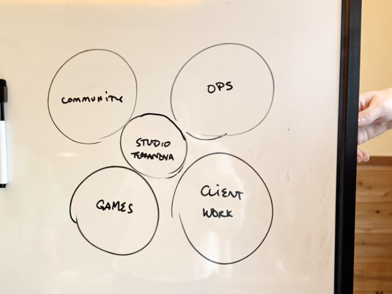
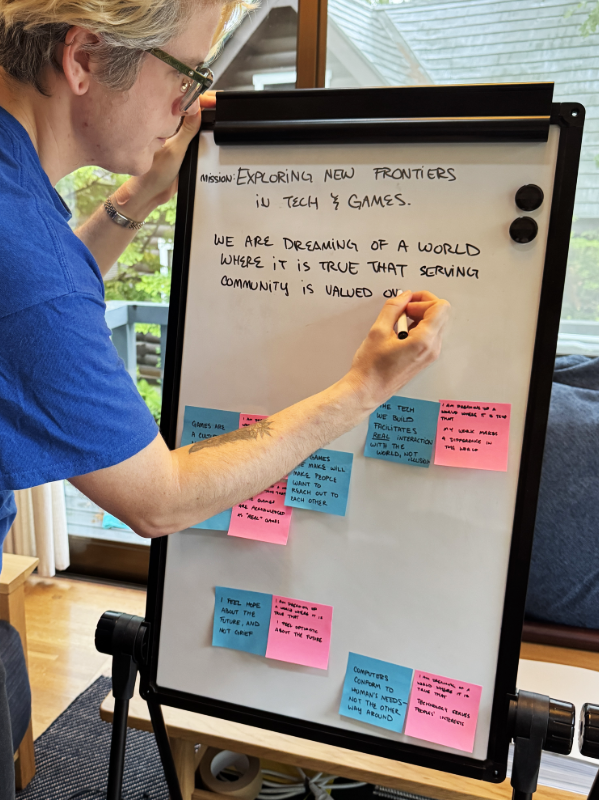
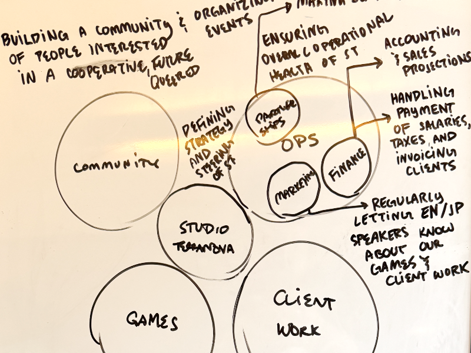
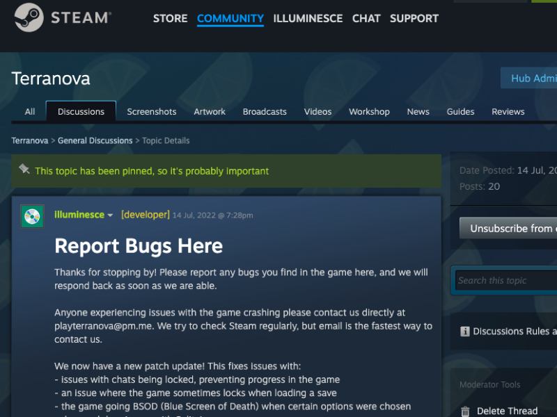
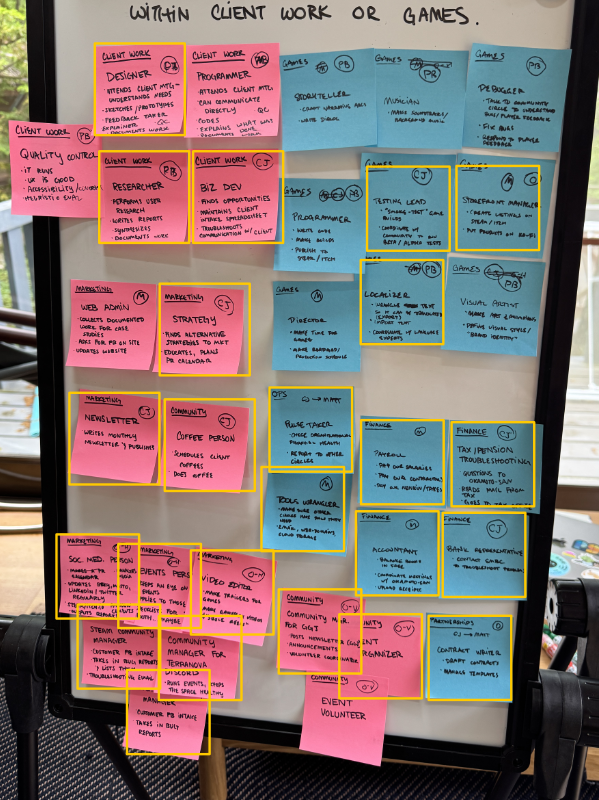
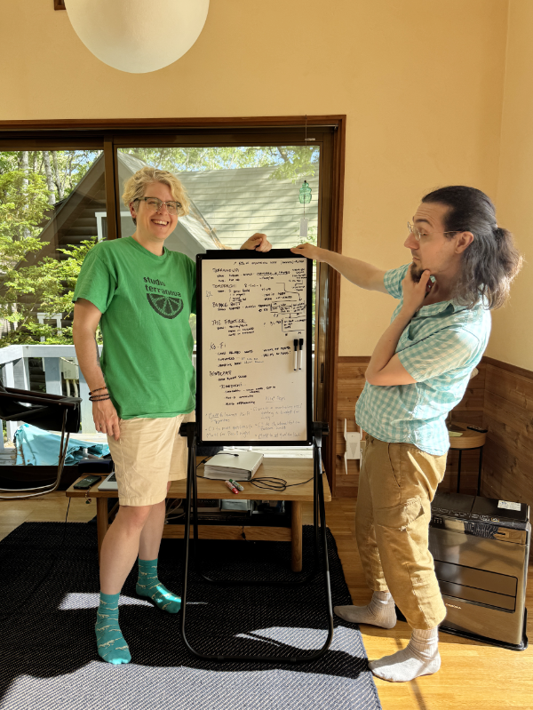

[In part one of **How Do We Share Power Dynamically?**](/blog/posts/2025-06-20-Sociocracy-Pt1/) I spoke about the cognitive dissonance between what tech promised the world versus what we actually built, discovering sociocracy through fandom, and why we wanted to try sociocracy for ourselves.

Part two is about how we implemented sociocracy at Studio Terranova and my own thoughts and learnings from that process.

Back to our retreat in Yamanashi.

It's an unseasonably brisk day for early June. I have picked our facilitator Heather up from the local train station. I asked for her help since mabbees and I have known each other a long time, and we can easily fall back into our old patterns. We wanted someone to push us outside of our comfort zones.

After some pre-reading of the sociocracy manual [Many Voices, One Song,](https://www.sociocracyforall.org/many-voices-one-song-2/) we dove into the first part of the day—going over the mindset of sociocracy and defining our vision, mission and aims.

## The mindset of sociocracy

Sociocracy sees power like water. Power is itself neither good nor bad. What matters is how it’s wielded. When it’s channeled to flow equitably, it can give a voice to all members of an organization. When hoarded, it becomes stagnant. The goal in sociocracy is to share power in a way that’s both effective and collaborative.

It is different than [founder mode](https://en.wikipedia.org/wiki/Founder_mode), which argues that by ceding all power to the leadership, decisions will be made quickly. This lacks foresight, as any short-term gains will be outweighed by longterm employee and customer distrust and toxicity. It is also different than [design by committee](https://en.wikipedia.org/wiki/Design_by_committee), which argues that making a solution that fits the preferences of everyone is the best way to build consensus. Design by committee lacks efficiency and can make deliberations that should be less than an hour drag on for weeks.

There are three principles of sociocracy I'd like to highlight that differentiates it from founder mode and design by committee:

1. **Equivalence.** Decisions are empowered to may be made by a few, but the flow of information is designed to elicit feedback from everyone affected by the decision.

2. **Working within the group's "range of tolerance".** It aims to find the option that is not necessarily preferred, but within everyone's range of *safe enough to try.*

3. **Encourages objections.** Objections are critical to the group's formed understanding of where their tolerance is, and so are treated as valuable information, not something to be quashed or ignored. In fact, the process of consent is always opt-in. Silence is not assumed as consent and if there is silence, it is considered an objection.

Bein exposed to this mindset made me very curious to learn more as most of the organizations I'd worked for, in principle, operated somewhere along the spectrum of "the leader decides everything" to "the group decides everything." Sociocracy seems to work outside of this spectrum.

Next, I'll go into what the organization of our company looks like under sociocracy.

## The organizational structure of sociocracy: circles

[Sociocracy](https://www.sociocracyforall.org/sociocracy/) is run in circles, which can also be called groups or bubbles. Membership in circles is consent-based; all members must consent to being part of a circle. How many aims an organization has will usually determine how many circles it has. Circles are dynamic. They can fluctuate over time, and if the aim is no longer necessary, they may dissolve.

As our studio does both client work and games, we created five circles to encompass each broad area of responsibility.

Below are our circle names and their aims:

- **General Studio Terranova Circle:** Ensuring our strategies align with our vision
- **Client Work Circle:** Providing high-quality bilingual services (user research, interaction design, UI programming) in Japan on a hybrid/full remote basis
- **Games Circle:** Creating queer narrative games for the joyfully alt
- **Community Circle:** Building a community of people interested in a cooperative, queered future
- **Operations Circle:** Ensuring overall financial health of Studio Terranova

I’m putting this up here as an example of what our organization looks like on the inside. We’ll get more into *how* we defined these aims in the next section.

## Vision guides the spirit, aims guide the work

Also known as the “north star", vision is the “to-be” state of the world—and in product design, the world as it exists *with your product in it.*

In sociocracy, it is structured as, *“We are dreaming of a world where it is true that...”*

There’s a lot of dreams we had for the future state of the world, such as…

- technology works in favor of humans, not against them
- serving community is valued more than serving capital
- we feel optimistic about the future

Ultimately, we went with: *“We are dreaming of a world where it is true that serving community is valued more than serving capital,”* as our vision and, *“Our mission at Studio Terranova is to explore new frontiers in technology and games.”* Our reason was that, as a consultancy, doing work pays our bills and making games pays our souls (and our bills a little).

We value capital the same way we value a place to live and financial independence—we cannot survive without these—but surely, we believe that wealth isn't measured solely in finance. We could have a place to live and financial independence, but if we got it at the cost of friends, family and personal health, we could hardly say we lived a life worth living. If we could value accumulating community more than accumulating capital, we would be putting what we preach back into the world and attract other people who felt the same.

I found that sociocracy’s method of generating a “to-be” state proved to be much more open-ended about how these future states were achieved. I liked this because “we make a new product or service and people buy it” isn’t always the solution to the world's problems. Sometimes, it’s implementing policy or education or starting a community space. While all of these involve design and creation, they aren’t limited to physical or digital products and services. There are many roads to changing the future, and we need not assume that selling a product is necessary to change it.

It’s exciting to think big like this. But once we had our vision, only a fraction of our work was done. Now was the time to get our hands dirty in *how* we would go about building that future—the more specific, the better.

According to *Many Voices, One Song*, aims should be defined as early in an organization’s life as possible and also be as specific as possible. A majority of conflicts arise in organizations due to everyone agreeing on a vision, but not agreeing on what the tactics are the organization should use to *achieve* that vision.

For instance:

> *If a group is planning to build a cohousing community in Toronto, it is helpful to narrow down where the community might be built. If some of the founding members can only live in the northern part of the city, while others cannot work with that, it is wiser to split up early and each group pursues their aim.*

Writing down aims was difficult, even amongst the two of us. It required negotiation—*”are we sure we want to leave out that group?”*—*”maybe we should be less specific here since we don’t know the landscape yet and will revise”*—but ultimately, it was very useful. I would liken this work to creating a [Business Model Canvas](https://www.strategyzer.com/library/the-business-model-canvas), but more open, since the Business Model Canvas is designed only to be used only within for-profit companies, which assumes a few critical things that don't necessarily have to be true.

This opened us up to consider things that were not typically “valued” in common for-profit businesses. Commonly in for-profit businesses "community" is something done to market—we are, in part, community-funded, but our community does not have to pay us to play in our space. Community is a way for us to give back and find like-minded people.

But exactly who *is* our community? In what way do we value them? From this, we created the Community Circle's aim:

- Building a community of people interested in a cooperative, queered future

We specifically chose the word “queered” as a verb—as in “queering games”—something I first heard in reference to game developer [Robert Yang’s](https://factoryinternational.org/about/press/news/robert-yang-queering-gamer-culture-gardening-game/) work. It is not only in reference to the player character being queer, but having queer experiences be seen as “normal” from the viewpoint of everyone in the world.

We make games, so naturally, we have a Games Circle. What kinds of games do we make?

- Creating queer narrative games for the joyfully alt

*Many Voices, One Song* had many example case studies for us to pick more incisive questions around our games; mabbees said that he wanted to build a future together with "joyfully alt" people like us, and I agreed. We're not "alternative" because it's cool - we're alternative because it is the way we are; and being able to live more authentically makes us happy. I believe our fans would agree with us.

What about our client work? We partner with for-profit, non-profit and government clients who care about how people will use their digital tools. We also work in both English and Japanese, and are based in Japan, so that should factor into our client work aims:

- Providing high-quality bilingual services (user research, interaction design, UI programming)  in Japan on a hybrid basis/full remote basis to organizations who care about how people will use their digital tools

This helps us laser focus on prioritizing and attracting clients that are a good fit to our skills and services.

Finally, in order for our business to function, it must be financially healthy, pay its taxes in Japan and adhere to our vision. Thus the last aims:

- Ensuring overall financial health of Studio Terranova
- Ensuring our strategies align with our vision

We have three sub-circles within the Operations Circle; Marketing, Finance and Partnerships. The Operations Circle's aim is “ensuring overall financial health of Studio Terranova.” We purposefully are treating marketing as daily operations; something necessary and important to our financial health, but not one that relies primarily on “monetizing” our community. We believe that if we make good things and treat our community well, they will want to support us.

In this way, or organizational structure at its core supports our vision of valuing community over capital.

## Domains—giving us the authority and autonomy to work

Domains are the areas in which circles have authority and agency to do work.

For example, take a website administrator whose aim is to “keep the website updated bi-weekly.” If they must rely on someone for a one-time password every time they need to log in, this stalls their work and makes it difficult for them to achieve their biweekly aim. Giving the administrator authority to manage both the login and the one-time password allows them to complete their goal seamlessly.

As a general example, many job posts state they are looking for workers who can work autonomously—but whether those companies are organized to enable autonomy is a different story.

A common misconception of autonomy is that it relies solely on the **will of the individual to be autonomous**, without taking into account whether or not they have been allowed the freedom to act by their surroundings. This can turn into a frustrating game where the company, who has power over the worker, expects more - but doesn't trust them enough to hand over power. On the other hand, workers who have been burnt out on a cycle of "power under" can see autonomy as a trap; if they've been burned before, why would they take on more responsibility if power isn't equitably shared?

Leadership is burned out on "rescuing" everyone, and everyone else is burned out on consistently having a lack of authority to make a change.

Breaking out of this is not easy. But I’d rather build a community with members I can trust and rely on than one where I am the sole authority who wastes away from burnout.

Let's take our **Community Circle,** whose aim is **to build a community of people interested in a cooperative, queered future** as an example.

We have a Discord community for fans of our games, and a Discord that I run as [a volunteer for game jams](https://ggjtokyo.neocities.org/) in Tokyo. I also regularly keep in touch with our clients via coffee. So the Community Circle's domain is:

- Games Discord
- Game Jam Tokyo Discord
- Volunteer Management
- Accepts Bug Reports and Player Feedback for Games ([Steam](https://store.steampowered.com/developer/studioterranova/), [itch.io](https://illuminesce.itch.io/) and Discord) and sends them to Games Circle
- Client Coffees

These are the things the Community Circle has full authority to act on. I have admin permissions to these Discords and as long as we're staying true to our vision, mission and aim, we can propose and change things.

An important part about defining domains is clarity and specificity.

![Text reads, If there is overlap in the domains of two given circles, the circles might step on each other’s toes. How do we notice if they do? Every time there is an argument following one of the patterns below, then we know there is an overlap between domains or a lack of education on what domains are... "Why did they do...even when we already did? Why did they change our...? Why aren’t they taking care of...? Why don’t they ever...? Do they not know they should...?" The simple answer might be: “because there was not enough clarity on how the domains were defined. In both cases, there might we feelings stirred up. The most constructive response, however, is curiosity: “I wonder whether our domains are defined well enough.”](sociocracy.png)

> *[Many Voices, One Song](https://www.sociocracyforall.org/many-voices-one-song-2/), p. 26*

The Community Circle handles the communication with players if they experience a bug in our games, but they have a point where they must handoff things to the Games Circle, who have the programming and design expertise to fix those bugs.

There is possibility that the handover process will be a source of conflict. What if the bug is critical but we lack the resources? What if the Games Circle fixes some bugs and doesn’t report to the Community Circle, and players get upset at the Community Circle? These are objections the Community Circle can bring up so that their domain can be properly shaped. For instance, an objection might be that they do not want to be the punching bag for angry, impatient players, so a potential new shape of the domain might be:

- if the bug takes longer than a week to fix, the Games Circle will tell the Community Circle so they can relay that to the player

- asking the Games Circle to asssess the difficulty of the bug so they can decide whether it is worth the effort to fix

- giving Community Circle permission to make guidelines for players to contact them for bugs

I enjoy this kind of “organizational shaping”—that is, building in enough structure for people to move autonomously but not so much structure that they are too restricted—because it allows us to shape to the level of flexibility or rigidity our company can safely try. 

Just like living organisms, organizations can come in all shapes and sizes and level of tolerance.

Once we had our domains defined to the point where we felt comfortable trying them, we moved on to roles.

## Roles

Defining roles proved to be one of the most surprising and eye-opening experiences for me that week. Going through defining roles helped us figure out *what* we were doing so that we could *delegate* or *drop* things. The blessing and the curse of being only two people is that our time and energy is very limited and since early 2024, a majority of our time in running the studio was mired in administrative work.

Unlike an LLC in the US, which is essentially a name that one can do business under, LLCs or 合同会社 in Japan require tax reporting and payments several times a year, accounting, and employment of a tax adviser. This is a downside if you’re running a small business in terms of money and time, but it is a benefit if you’re doing client work and selling things in Japan—there is a lot more trust and legal benefits for a properly formed business than 個人授業, an individual proprietorship.

We were both full-time workers who made video games on our nights and weekends, who transitioned to contract workers who did bugfixes and marketing for the video games they had already made on nights and weekends AND went to the tax office on our lunch breaks. No time to explore new projects. By our retreat, we were *burned out*.

The first step to understanding how overworked we were was to lay our roles out. Once we assigned ourselves to lead a circle, we wrote down the the roles we’d already been doing, one per sticky note.

The results were humbling.

Out of the 34 roles on this board, **I had been handling 24 of them solo.**

No wonder I had no time to brainstorm new ideas or make games.

Some strong feelings came up for me, mainly confusion (how did it get so bad?), resentment (why am I doing this alone when I have a co-founder?) and amazement (I didn't know I could handle that much stress). I had brought up vague feelings of being overworked in the past, but didn’t have the downtime to clarify what roles were being done and what knowledge was needed to do them.

There were a few reasons for this imbalance:

- I am more confident in communicating in business-level Japanese and many of the administrative tasks required me to call someone or navigate websites in Japanese
- no skill sharing on my end on around how to do a role, so it appeared I "had it under control" when I was overwhelmed
- no clear domain or process of consent around picking up roles, so if a deadline was approaching, I'd start to get nervous and proactively pick up a role.

If you're familiar with [Karpman's Drama Triangle](https://www.attachmentproject.com/psychology/drama-triangle/), I am much more comfortable as a coach or a creator, but when stressed I can fall back on a *rescuer* role.

Well, color me called out.

After I processed my mixed feelings, we went through each post-it decided our roles and their term length. Some of the roles we picked up joyfully; others required more careful consideration into what sociocracy calls our [range of tolerance](https://www.sociocracyforall.org/range-of-tolerance/).

I mentioned this earlier in the article, but our range of tolerance is the area in which we think something is “safe enough to try.” We all have specific individual preferences; finding collaboration solely within our range of preferences will end up in some roles being undone and aims unachieved. No one wants to take out the garbage in the house, but if you do not, your house will be full of garbage, which is the opposite of our aim, a clean(ish) house.

> *Or if a clean(ish) house isn't your aim, you might be a raccoon. (photo by [Quentin Bounias](https://unsplash.com/@qbounias))*

Something outside of your range of preference but still within your range of tolerance could be:

- Something you're not good at, but don’t see the harm in failing
- Something you are okay doing for a short period of time
- Something that, if the role were adjusted and it still achieved its aim, you would be okay taking

This range can allow us to enter into a healthy dialogue about what parts of the role we object to and how we can shape it. Going back to our previous example, if our aim is to have a clean house with no trash on the floor, and we are worried about forgetting the trash, we can find ways of reminding ourselves, request a reminder if it gets past a certain level of uncleanliness, or try for a short amount of time to see if we would really forget.

This kind of consent shaping was, outside of my romantic partners, the first time I’d had critical, compassionate conversations about where my range of tolerance was listened to and taken into account in a way that both served my needs and others around me.

We also determined that we needed to hire someone for an operational role—in particular, a paid apprentice who could:

- help us post on social media regularly about our upcoming games in English and Japanese
- can assist CJ in making graphics, GIFs and videos for marketing games
- can help us apply for in-person events and keep on top of submission deadlines
- can help us manage our Steam and itch.io bug reports
- is interested in making games and marketing games

We call it an apprentice position because we’re willing to put in time and energy to help this person grow—we'd rather have this person move on with new skills than force them to learn everything solo. We’re still shaping our budget and how many hours a week we would need them for, but through the process of defining our roles we now have a very clear idea of what we need help with and what the domain of this person would be at Studio Terranova.

## In conclusion

We tried out sociocracy at our studio with the hope that we would get connection and clarity in our work—and that, I can happily say, has worked well. In fact, we got more clarity than I expected.

It is more clear who works on ***what*** part of our workflow, and how we can effectively hand over work; who we need to hire to grow, and what the baseline is we need to meet to succeed. I feel confident that the way we are organized as a cooperative is in alignment with our values; we center both us as people and the work we do. I learned—and still am learning, a lot from my fellow [BobaBoard](https://bobaboard.com/) volunteers.

Thank you so much for your dedication to making the web more technically accessible and for all the resources you've shared with me.

I mention the book, [Many Voices one Song](https://www.sociocracyforall.org/many-voices-one-song-2/) throughout. I bought a personal copy, read it and took it to our retreat to reference. I highly recommend it. We also utilized the “Silent Start” method for our retreat—we read excerpts from the book right before we would make decisions so that everyone was more well-informed.

Many thanks to [AQ who hosted us](https://www.aqworks.com/bluehouse), and [Heather Dobbin](https://www.linkedin.com/in/heather-dobbin/) who helped facilitate this retreat—without her help, I doubt we would have the clarity of insights we did.

## Resources

- [Sociocracy for All](https://www.sociocracyforall.org/): Comprehensive guides on what sociocracy is and how to implement it.
- [Collective Power: Patterns for a Self-Organized Future](https://www.sociocracyforall.org/books/#collective-power): A deeper dive into the mindset of sociocracy.
- [Many Voices, One Song](https://www.sociocracyforall.org/many-voices-one-song-2/): A detailed handbook for implementing sociocracy. I recommend reading "Collective Power" first to thoroughly understand the mindset.
- [Rebuiding Community on the (Fujo)Web, pt. 1](https://www.essentialrandomness.com/posts/rebuilding-community-on-the-web/part-1): About burnout in fandom spaces. From Ms. Boba's Citrus Con 2024 talk.
- [Rebuiding Community on the (Fujo)Web, pt. 2](https://www.essentialrandomness.com/posts/rebuilding-community-on-the-web/part-2): About how power dynamics need to be challenged to grow. From Ms. Boba's Citrus Con 2024 talk.

---

### Related Posts + Links

- [How Do We Share Power Dynamically? Part One](/blog/posts/2025-06-20-Sociocracy-Pt1/)
- [What part does tech play in a hopeful future?](/blog/posts/2024-11-09-A-Hopeful-Future/)
- [The Birth, Death and Rebirth of Slash](https://yesterhost.neocities.org/zine/issue-00/07/)

See all posts tagged [Tech And Web](/tags/tech-and-web/).
