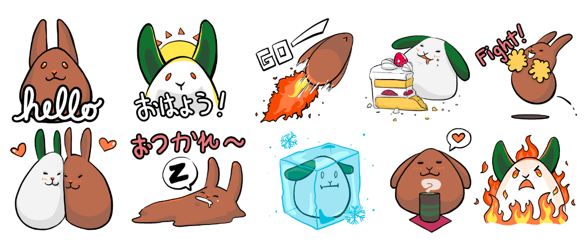
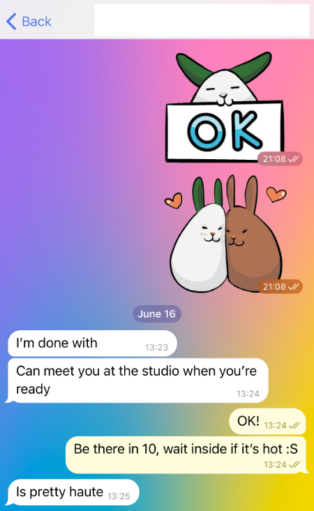
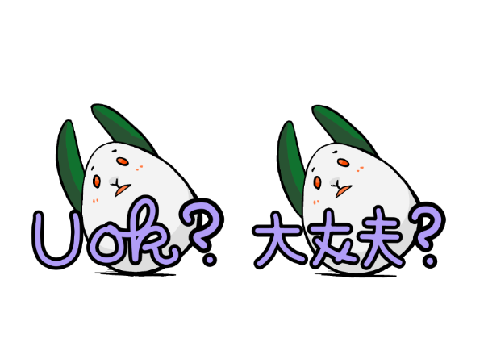
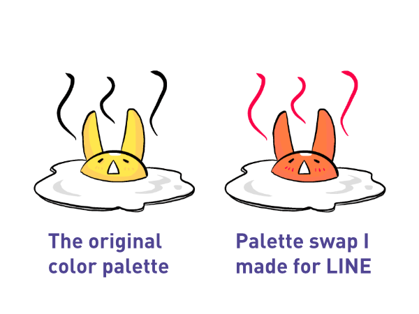
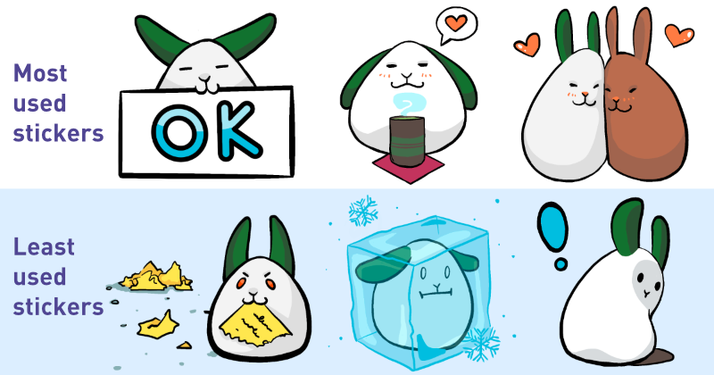

Some time ago, [I made 24 chat stickers for some little eggbunny characters named Mochi (white) and Mugi (brown)](/blog/posts/2023-05-21-Mochi-the-Eggbun/). They're available on Signal, Telegram, and LINE below.

I recently found my original files for these stickers and wanted to write up my learnings. This project started as a way to learn how to batch export illustrations in Procreate. I'd planned for only six bunnies as an experiment; but the full stickers ended up being eight times that (24 stickers in 2 color variations).

Since folks seem to like my rabbit drawings (it's slimebunny is one of my most drawn characters in ArtFight), I thought folks would like to see more of the sticker set and some of my reflections on it.

First is the obvious...

### Stickers are fun to make and fun to use

I use these stickers on the regular. It's a part of my daily routine to look at my own art, and that makes me smile. It's been helpful in reminding my inner critic that yes, I actually *do* make art people enjoy.

I hope if other folks are using them, they are enjoying them, too.

### Making an outline brush made making the text a lot easier

This brush really helped me make some of the handmade text I have in my stickers. In Procreate, it's easy to make an outline brush—I used the Calligraphy Brush as a base, so it has a nice, thick outline.

My tutorial was in Japanese, but [here's one in English for folks that are curious.](https://youtube.com/shorts/YcRi3r0yYTM?si=-yeywqM3B4MMbKMg)

A snag I ran into while making the text was that the outline brush often at its smallest setting was still too big for my canvas; so I made a new layer, wrote the text at a larger size, and shrunk it.

> *An example of the outline pen.*

### LINE stickers cannot have the same sticker in two sets

LINE checks to make sure each sticker in the series is "unique" whether that be in pose or coloring, so they flagged the "hot" sticker for both Mugi and Mochi is a yellow egg melting on the sidewalk. I wasn't sure what to do with that feedback—the egg is funny, and I wanted to keep it.

So, only for the LINE version, I had to make an adjustment to the color so that the Sticker Shop would accept it as a "unique" sticker.

I understand that this is to prevent duplicates in the LINE store, but in my case it seemed rather unnecessary.

### Often sometimes your funniest stickers will be the ones you use the least

After using these for a while, I've realized that most of my sticker usage is around inviting people to tea or coffee, expressing affection, and confirming something someone has said. These stickers are cute, but not as dynamic as my *least* used stickers.

I would love to have an excuse to use the "destroy the evidence" bunny.

---

Here's a playback video of my work on the stickers where you can see them go from sketches to their full glory. (~2 minutes)

<iframe width="560" height="315" src="https://www.youtube.com/embed/2O4c0Qqkibw?si=fB5OCdgyLKX3uPev" title="YouTube video player" frameborder="0" allow="accelerometer; autoplay; clipboard-write; encrypted-media; gyroscope; picture-in-picture; web-share" referrerpolicy="strict-origin-when-cross-origin" allowfullscreen></iframe>

It was a fun project. All these stickers are available for free or for a nominal fee of 140 yen. And, if you found this article inspiring or useful to you, [**consider tipping me on Ko-Fi**](https://ko-fi.com/illuminesce).

Until next time! Enjoy the stickers.

### Signal (free)

- [Mochi the Eggbun](https://signal.art/addstickers/#pack_id=37538c972d358bcef121055c3dce7a19&pack_key=8fc47d2935699af34780c1d6f6c82cd51475327e650b19837e90e8671db60978)
- [Mugi the Eggbun](https://signal.art/addstickers/#pack_id=627075ba7361a104dc256c8a69cbf686&pack_key=0a0d558584bfa42176edd3e1b6dbdc8e0b50c18aae4aad6c07cdcc3ab56e1302)

### LINE Stickers (EN and JP, 120 yen)

- [Mochi the Eggbun](https://store.line.me/stickershop/product/23204797/en?utm_source=gnsh_stickerDetail)
- [Mugi the Eggbun](https://store.line.me/stickershop/product/23215688/en?utm_source=gnsh_stickerDetail)
- [卵ウサギもちくん](https://store.line.me/stickershop/product/23213003/ja?utm_source=gnsh_stickerDetail)
- [卵ウサギむぎちゃん](https://store.line.me/stickershop/product/23213004/ja?utm_source=gnsh_stickerDetail)

### Telegram (free)

- [Mochi the Eggbun](https://t.me/addstickers/MochiTheEggbun)
- [Mugi the Eggbun](https://t.me/addstickers/MugiTheEggbun)

---

### Related Posts

- [Mochi and Mugi the Eggbun](/blog/posts/2023-05-21-Mochi-the-Eggbun/)
- [Game dev comics](/blog/posts/2023-12-13-Game-Dev-Comics/)

See all posts tagged [Art](/tags/art/).
