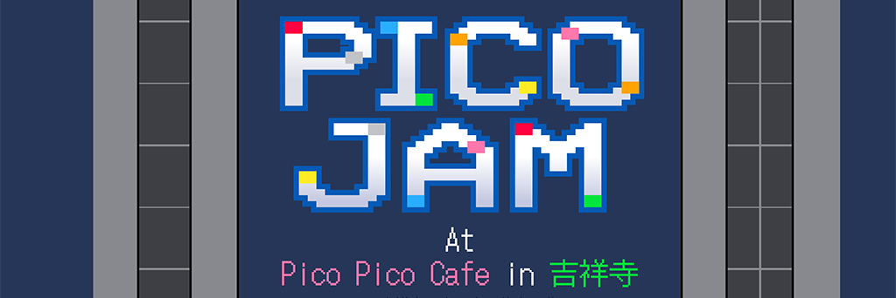

*PICOJAM graphic done by [CYANSTAR](https://x.com/CYANSTAR5).*

[日本語版はこちら。](/blog/posts/2025-09-08-PICOJAM-2025-JP/)

Thank you for your patience while I wrote up this after-report—August was busy!

PICOJAM was a PICO-8 only hackathon (also known as a game jam) held at Pico Pico Café in Kichijoji from Aug. 9th-10th this year. Our jam themes were 「溶ける」or MELT, and 「祭り」or MATSURI. We had ten participants and made six games and two free PICO-8 asset packs, one for pixel art and another for music.

Thank you to zep for having us at the Pico Pico Café, and a huge thank you to everyone who participated! 🎆

[See our games on itch.io here.](https://itch.io/jam/picojam-2025/entries)

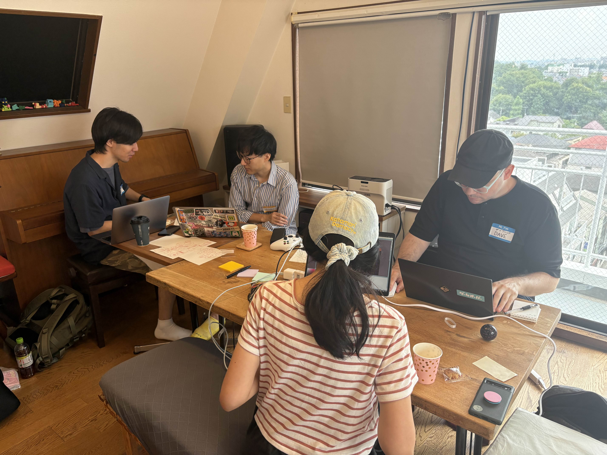

## What is PICO-8?

PICO-8 is a fantasy console that is for making, sharing and playing tiny games. Games are in 8-bit 2D and the engine includes a code editor, a sprite maker, a map editor, and a music/SFX maker all in one. It’s based in Lua and has a forum of sweet and dedicated fans. Notably, Matt Thorston and Noel Berry’s [Celeste](https://www.lexaloffle.com/bbs/?tid=2145) and shoma’s [MOTION REC](https://www.lexaloffle.com/bbs/?tid=53392) were originally made in PICO-8.

There’s a lot of reasons why PICO-8 is fun to develop in; it has so many design constraints that a lot of decisions are already made for you. Open Unreal Engine and you may marvel at the switches for hours—but in PICO-8 you can start making a game the moment it boots up.

## How did PICOJAM happen?

I was originally introduced to PICO-8 while organizing Global Game Jam (GGJ). I’m a fan of engines that have very low “start up cost” like Twine and Bitsy, since I prototype game mechanics quick and dirty first, and then build from that. After I made my first game in it, I was sold.

Some time later, I happened to run into another PICO-8 fan, [uchuzine](https://x.com/uchuzine), and he invited me to a regular meetup where PICO-8 fans would show off the games we made and chat over dinner. Naturally, being indie devs our work is very solitary, so we wondered—how about we do a weekend hackathon? And what better time to do it than August, a month where we’d all rather be inside, anyway?

I helped organize and run it; and it was a blast.

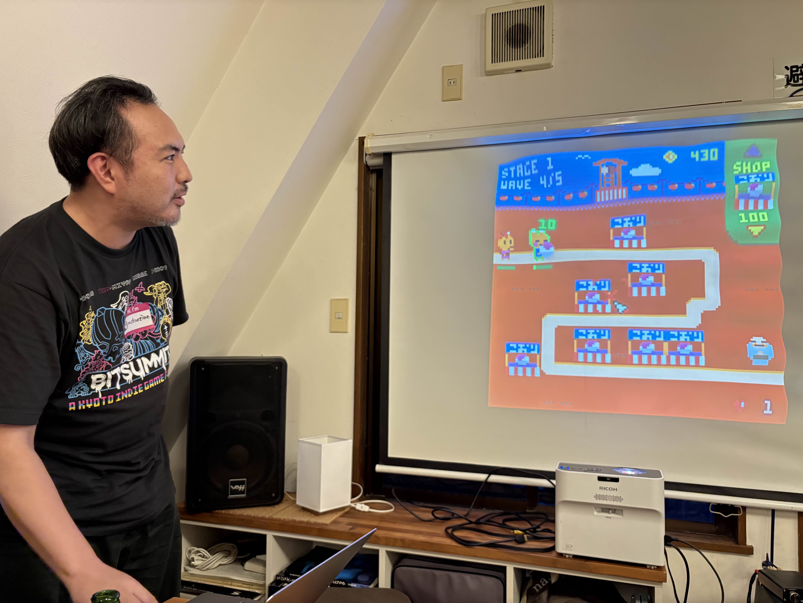

## Enough setup! Show me the games!

With pleasure! If you play the games and like them, please comment on them and show the creators some love.

### hanabi-shi

A game about designing fireworks. Play around with weight, life, and color to design your own delightful fireworks.

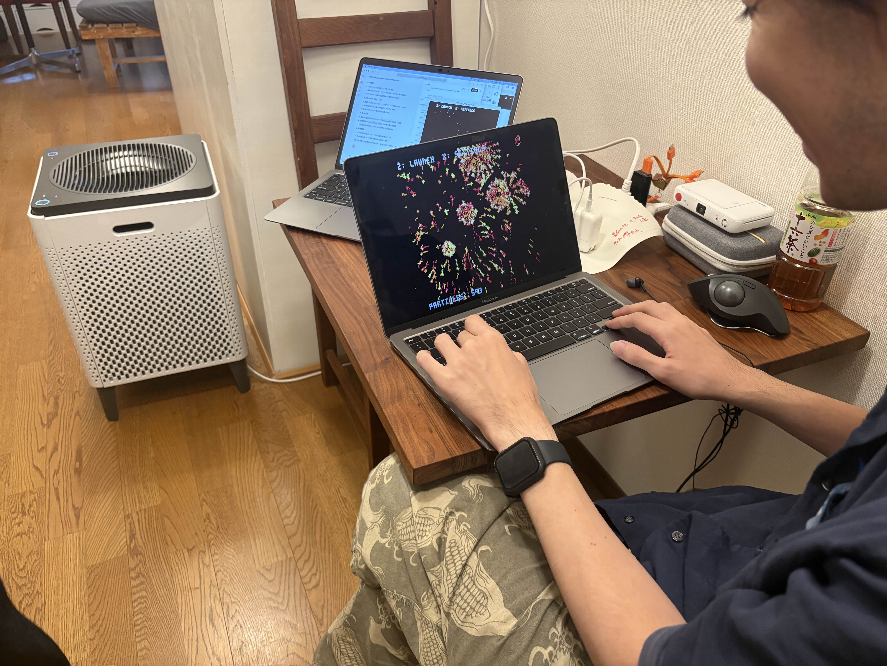

**Theme:** MATSURI

**Created by:** [hiko](https://bsky.app/profile/hikogame.bsky.social), [shoma](https://www.donutshunter.com/)

[Play on itch.io](https://hikokyoujurou.itch.io/hanabi-si)

### Taiko Terror

You are a bug on a taiko drum—try to stay in the hit circle long enough to score points—but don't get squashed!

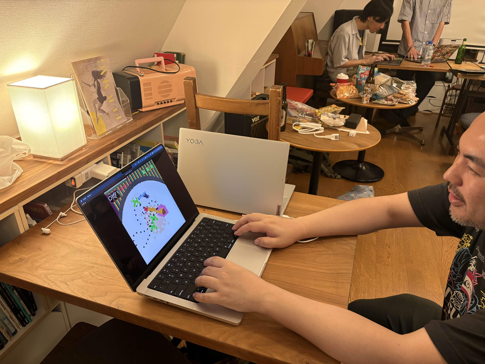

**Theme:** MATSURI

**Created by:** [ugokuware](https://ugokuware.com/), [illuminesce](https://illuminesce.itch.io/), [mabbees](https://mabbees.itch.io/)

[Play on itch.io](https://ugokuware.itch.io/taiko-terror) | [Play on the BBS](https://www.lexaloffle.com/bbs/?pid=171905#p)

### PICOGORI 2025

Make shaved ice for animals at the festival! (there's no ending! you just make shaved ice forever.)

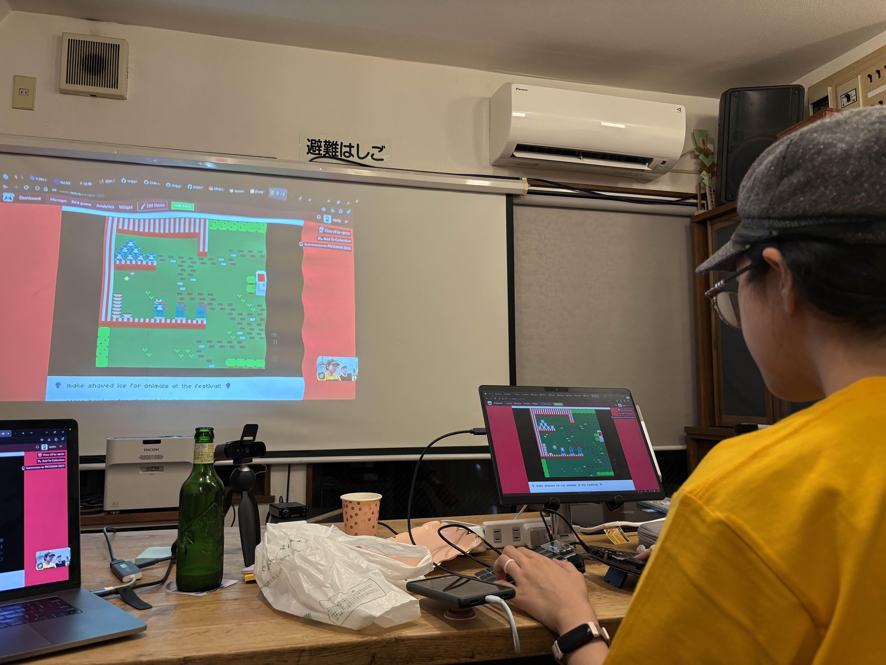

**Theme:** MATSURI

**Created by:** [davemakes](https://davemakes.itch.io/), [npckc](https://npckc.itch.io/), [mabbees](https://mabbees.itch.io/)

[Play on itch.io](https://npckc.itch.io/picogori-2025) | [Play on the BBS](https://www.lexaloffle.com/bbs/?pid=171953#p)

### OMATSURI TD

This is a tower defense game to liven up a festival! The range of aroma differs depending on the shop. Preferences also vary by age (child/adult) and gender (male/female).

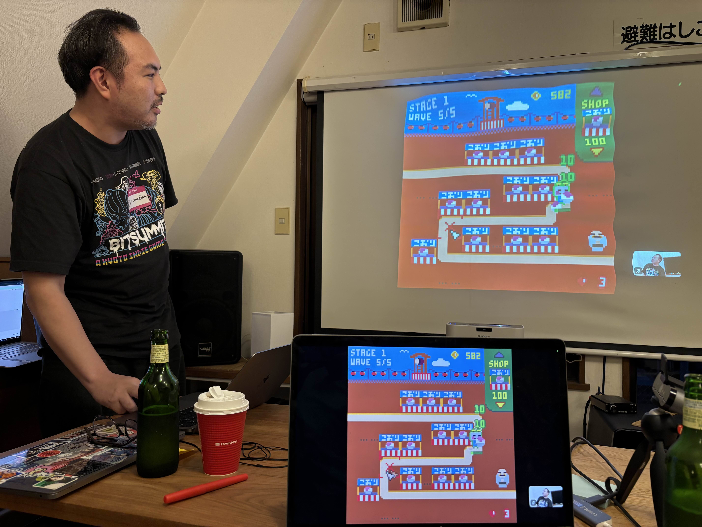

**Theme:** MATSURI

**Created by:** [uchuzine](https://x.com/uchuzine), [npckc](https://npckc.itch.io/), [mabbees](https://mabbees.neocities.org/)

[Play on itch.io](https://uchuzine.itch.io/omatsuri-td) | [Play on the BBS](https://www.lexaloffle.com/bbs/?pid=172018#p)

### Anxiety Festival

Some friends invited you to the local festival, but you don't really like crowds! Avoid strangers, find your friends, then find a place where you can enjoy the festival in peace.

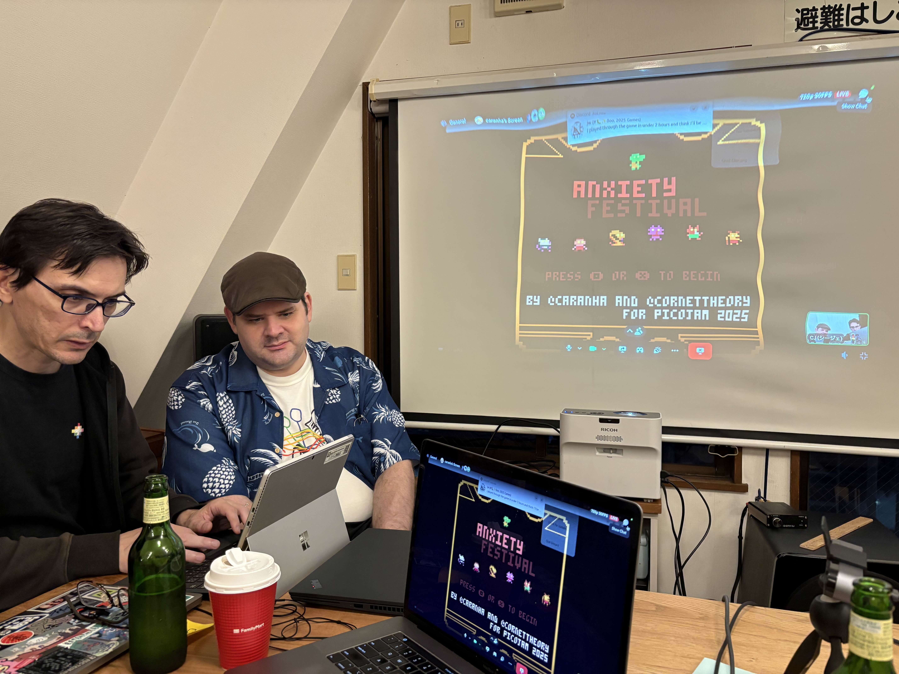

**Theme:** MATSURI

**Created by:** [caranha](https://caranha.itch.io/), [CornetTheory](https://onlyintheory.com/)

[Play on itch.io](https://caranha.itch.io/anxietyfestival) | [Play on the BBS](https://www.lexaloffle.com/bbs/?pid=171899#p)

### Bernie Visits the Wax Museum

Bernie Cinders is a young fireball who enjoys toasting marshmallows, playing in dry leaves, and visiting the wax museum.

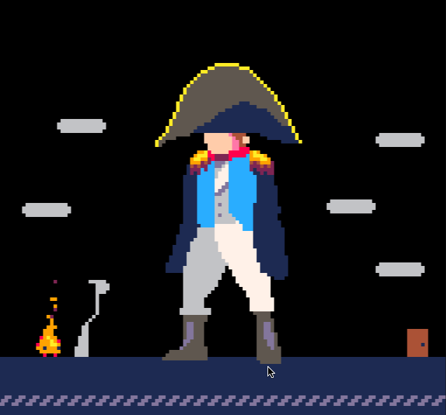

**Theme:** MELT

**Created by:** [zep](https://bsky.app/profile/lexaloffle.bsky.social)

[Play on the BBS](https://www.lexaloffle.com/bbs/?pid=171992#p)

----
mabbees made a lot of music for this jam—he has a [more in-depth blog post about his process here.](https://mabbees.neocities.org/posts/016-picojam-2025/) He released the songs he made in a free asset pack you can use for your Matsuri-themed PICO-8 games—or other engines of choice.

[Download Matsuri Music here](https://mabbees.itch.io/matsuri-music)

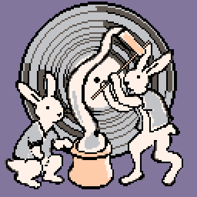

I didn't have a lot of mental space to contribute, being the organizer, but at the final hour I thought—*dammit, I want to make something fun* and ended up making a huge free asset pack with 8-bit jams and matsuri foods—get it? for *jams haha.*

Feel free to use them in your non-commercial projects!

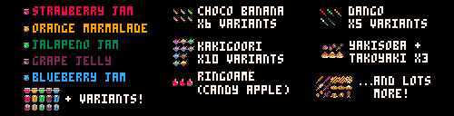

[Download MATSURI // JAM 8x8 Pixel Art here](https://itch.io/jam/picojam-2025/rate/3801192)

----

## Let's do it again!

I was really happy with the jam overall. People had fun, made a ton of creative games, and made new connections. It's the kind of space I look to create; where people feel comfortable and vulnerable and silly enough to play around and make new connections.

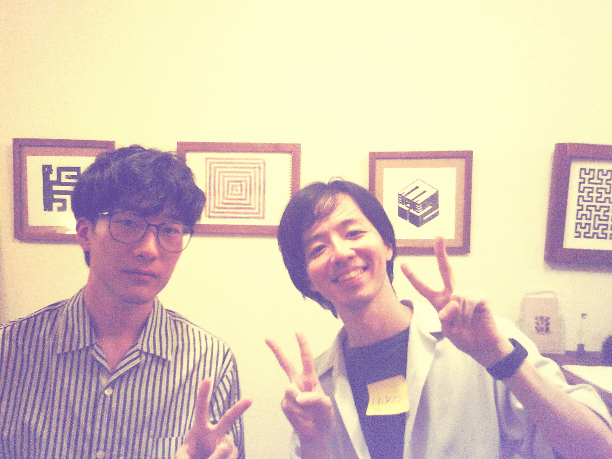

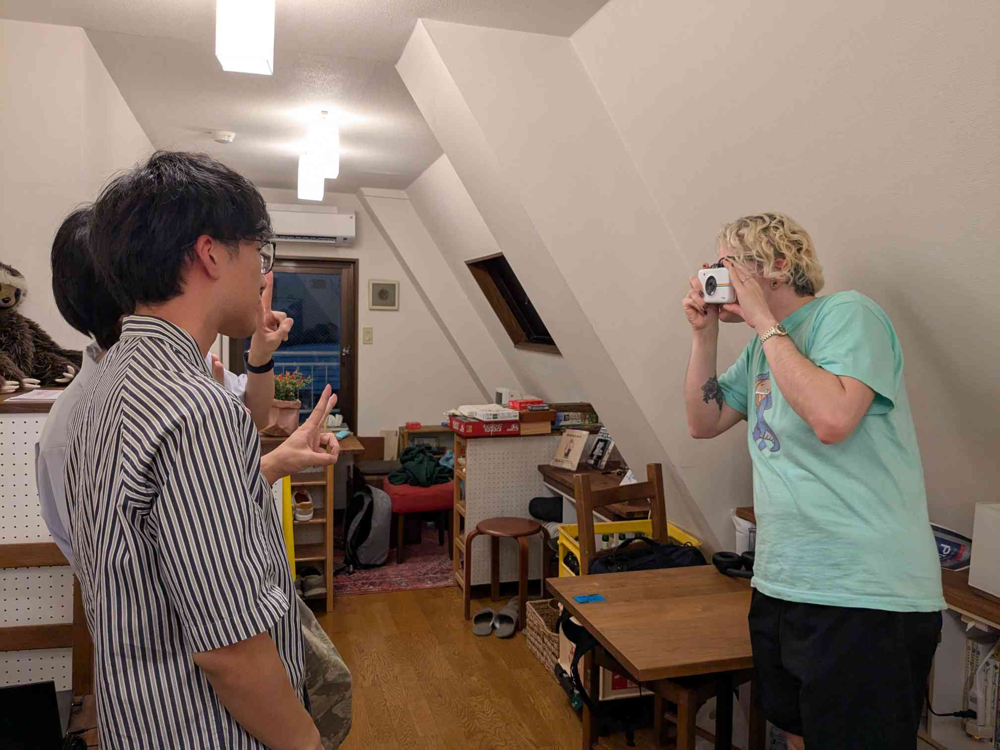

I've been itching to make a series of posts—or a zine even—about running game jams specifically in Tokyo. I've learned a lot about organizing in a place where venue space is at a premium, how to connect people who wouldn't otherwise talk with each other together and how to mix languages without solely relying on English. I wonder if anyone would be interested in something like that?

Thank you again to everyone who participated! It was fun, and I'm excited to do something like that again.

---

See all posts tagged [Organizing](/tags/organizing/).

