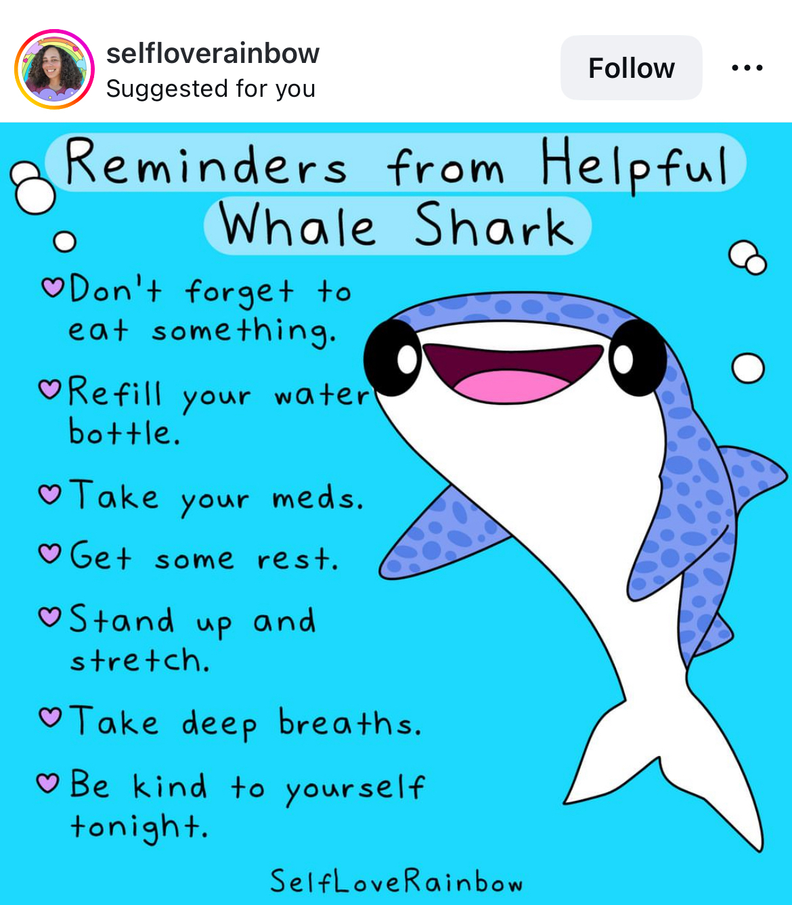

[Kelly Turnbull](https://x.com/Coelasquid) made a dark joke on Twitter that they assumed they would die at 35, so didn't think too much about working long hours during crunch time as an animator. (I wish I had the direct quote, but Twitter has become unsearchable.)

Instead of being shocked and sad, I found myself nodding. I never saw myself living long. Many of my family members had already passed under unnatural circumstances before I was in my mid twenties. I used to call it family curse. My parents laughed it off—I continued to believe.

It was exacerbated by my peers' lack of understanding what "over 35" looked like; associating as a teen with anyone older than me was seen as dangerous. I had no template of middle-age beyond my family members who I saw infrequently.

*Pictured: Auron from Final Fantasy X, my main representation of what over 30 looked like. He's 32.*

That's what made my hyper-anxious, hyper-productivity so personal; I didn't have time left, I never had time, so I had to do as much as possible, experience as much as possible before I finally kicked it. Devon Price's book [Laziness Does Not Exist](https://www.goodreads.com/book/show/54304124-laziness-does-not-exist) hit me right in that sore spot—the one where I use productivity as a salve to ease my own anxieties about relationships, the world, and a fundamental detachment from my physical body due to dysphoria.

The premise is this—that particularly people born in the U.S. are suffering from a cultural malaise called the "Laziness Lie"—a lie that states your worth is measured only in your productivity, that you cannot trust your body and your feelings, and that there is always more that you could be doing.

It has its roots in American Christian Puritanism which claimed those who are the hardest workers are the ones God chose for salvation. Over time, the message became detached from religion and embedded in common sayings—"to pull yourself up by your bootstraps" or "having grit" or "putting in blood, sweat and tears" are seen as positive traits in the U.S.

That is not to say that these are *solely* U.S. concepts—overwork is common in Japan, although it's usually attributed to toxic workplaces than largescale societal and social pressure. Most folks I know here who overwork "are forced" to and know it is illegal but have little power to fight back, rather than Americans, who say they "should" and self-police their productivity.

This poisonous "should" was something I had to unlearn when living abroad. People look at you funny when you talk about "side gigs" that make money, because most folks don't do side gigs for the money. They do it because they enjoy it which is an absolutely *normal* way of thinking about hobbies. It highlights how *abnormal* the way folks from the U.S. talk to their kids about their hobbies. As a young creative growing up in the States, I could never escape this talk. 

- "You're so good you could open an etsy store!"

- "Have you thought about going full-time?"

- "Do you take commissions?"

There was so much in this book that I could talk about, but I'll try to focus on one aspect of it: how much I appreciated the tactical advice it gave targeted *specifically* for people like me whose calendars are packed months in advance and who don't think about "rest" as anything more than a passing thought. Worse, it becomes yet another "should" pressuring me: *I really should rest.*

### Fuck you, "restful" Instagram

Amongst queer spaces it's popular for folks to share twee, pastel memes of cute animals resting. As a chronic workaholic, I despise these memes. I don't dislike the people sharing them—I'm sure it does something for them, but the cartoon animals that remind me to "rest" without telling me "how" and my brain is so tired and overworked that it feels like they're mocking me.

*"Refill your water bottle!"* a cute whale shark burbles at me at 1AM while I'm working on a proposal. 

I'm working at 1AM on a proposal because my day was full of meetings from 8AM to 8PM; I took some time to hang out with my partner in the evening time, and in the middle of that my ADHD brain realized I had a deadline today I'd forgotten about. The software that I'm using to draft the proposal is under through maintenance, so instead of auto-calculating prices, I have to hand-calculate them.

**Fuck you, whale shark.** My water bottle is refilled and I'm *still* suffering.

I've had similar issues with "mindfulness meditations" — sitting still has never been my strong suit, and so when I find myself in these meditations, if body movement isn't involved I find myself tidying up or working on a project five minutes into the meditation. Oops.

### Dampening Happiness versus Savoring Happiness

Instead, Devon suggests an alternative way—learning how to reframe what is valuable in life and how to tactilely savor things. I find this far easier for me to disgest and less insulting than general advice. He explains, "when a person savors, they relish the things they love and devote their full attention to experiencing them in a mindful, appreciative way...By discouraging us from showing any signs of weakness and vulnerability, the Laziness Lie teaches us to engage in *suppression,* the hiding of signs of happiness in order to appear serious or mature."

"The Laziness Lie also loves keeping us *distracted;* as overachieving workaholics, we're all expected to multitask all day long; never taking a moment to fully luxuriate in a good meal, a golden sunset, or a leisurely walk around the block."

I felt these words to my bones. So often I'd experience a moment so emotional I'd suppress it; or was so distracted I couldn't fully appreciate it. Looking back on it I'd point out some good things but mostly focus on the things that I could change—which was *also* another negative mental pattern that kept me exhausted and unhappy. I was thoroughly called out.

As an alternative, he suggests being fully present—that is—really drinking in the details of a good experience. I found parallels to this in their passage on active reading: learning to visualize what is being read, clarify and dive into the "what" of each passage, and connect the writing to things that you already know helps their students more actively read and retain information. The same can be said for moments as well. When remembering a good memory, I've recently found myself wondering:

- What does this memory smell like?

- What sounds can I hear?

- What were the words I heard that really touched my heart?

These questions I've found to be much better goalposts for practicing mindfulness than simply, "take your meds, hydrate, be mindful."

[Laziness Does Not Exist](https://www.goodreads.com/book/show/54304124-laziness-does-not-exist) hit me at a very critical moment; after my sabbatical in 2023 I threw myself immediately into starting a business and succumbed to the Laziness Lie. And with good reason, too—[building a business, and in particular, a worker-owned cooperative is difficult](/blog/posts/2024-12-30-2024-Reflections/). There are deadlines on taxes and salary payments that cannot be "pushed back." Money is something that pays our bills, and if we don't have it, we lose a lot of financial freedom. Much of what mabbees and I are navigating right now is not something that has *any* infrastructure or support in Japan—that is, establishing a financially stable video game cooperative. 

In addition to doing the thing, we have to do research on our own, trust our intuitions and find the people who are willing to support our business as both foreign-owned in Japan and a cooperative. Much of what we have built is either with the help of communities that are willing to reach across the world internationally or we just have to do it alone. We don't have much of a choice. In this atmosphere, I think it's easy to overwork. We've already come far as a studio and continue to grow and [rely on support from fans](https://ko-fi.com/illuminesce) and other co-operatives to survive.

And me, I'm past 35. I made it. Sadly, I do not have a cool sword like Auron. And unsurprisingly, I have a stress-related illness from putting myself under pressure for so long. But, in general, good health is something I thankfully have at the moment. 

Which means that now I'm looking in front of me wondering, *if I'm still here, what is the most meaningful and happiest way for me to live?*