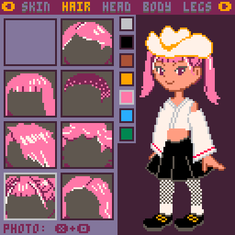
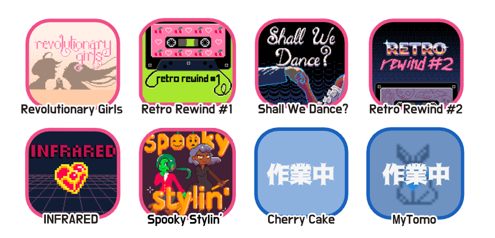

This Halloween, I'm thrilled (pun intended) to announce the launch of our super special minigame, [Spooky Stylin’](https://illuminesce.itch.io/spooky-stylin) — available for free as part of [Dollmaker Jam](https://itch.io/jam/dollmaker-jam)!

The sixth game in our Tomodachi 8-in-1 collection, this game will take you back to those late 90s, early 00s evenings spent meticulously crafting an avatar to use on LiveJournal, AIM, or MSN Messenger—but extra spooky!

Mix and match your headgear, hairstyle, tops, and bottoms to dress up your avatar!
- 7 outfits to choose from, allowing for over 300 potential combinations!
- Really cute pixel art, if we do say so ourselves! (mabbees and I did it ourselves)
- Take photos of your character in the game and share them on social media!

I'm super grateful for our community that’s always stuck around, and for their kind words of support for the little piece of universe we’ve created. As with other games in Tomodachi 8-in-1, this fun digital nostalgia is a glimpse of what Tourmaline, Ephemeral Smile, Cherry, and Sendaria would have enjoyed in their days, and I hope you, too, will enjoy it as much as they did.

[Check out Spooky Stylin' (free)](https://illuminesce.itch.io/spooky-stylin)

[Get the whole bundle of games for $3](https://illuminesce.itch.io/tomodachi-8in1)

