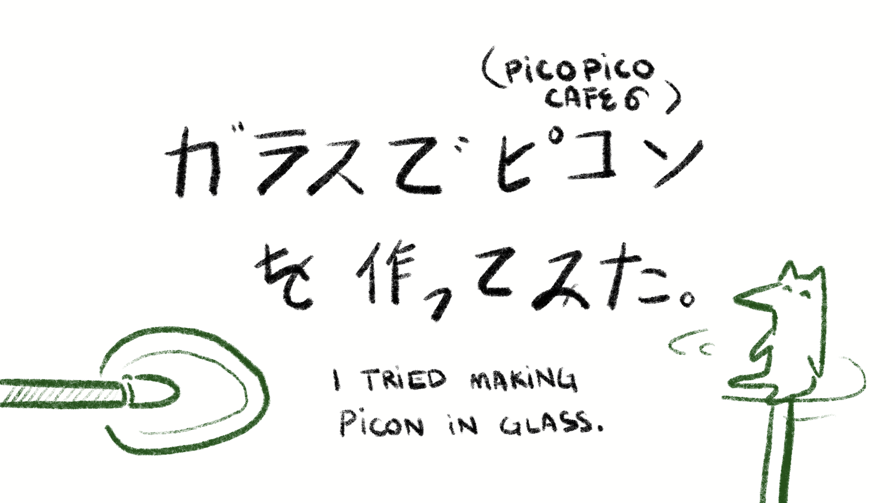
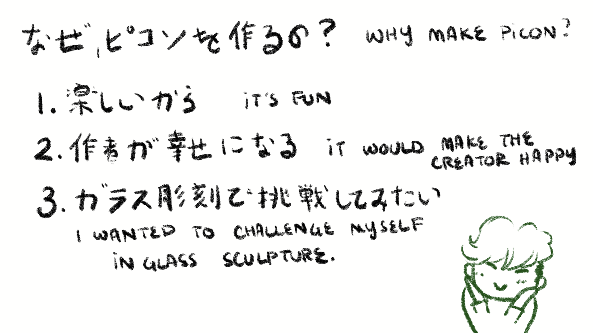
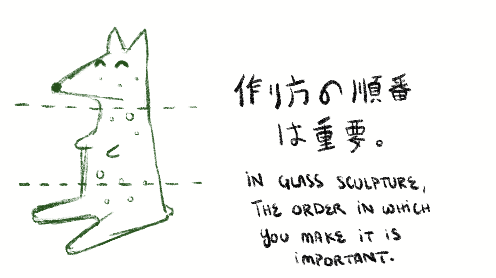
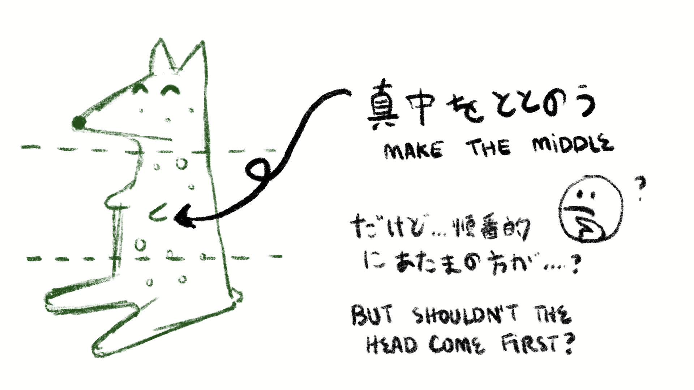
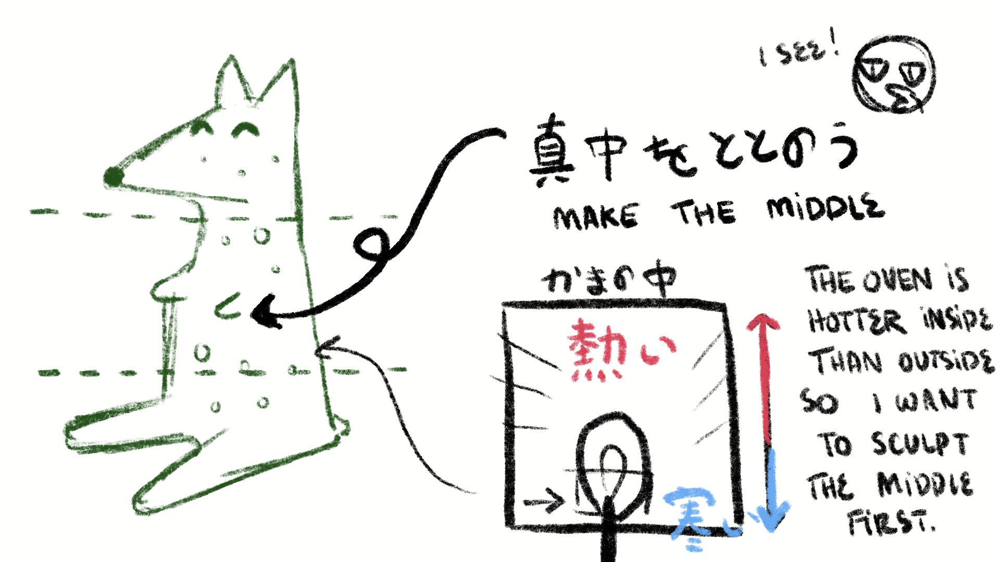
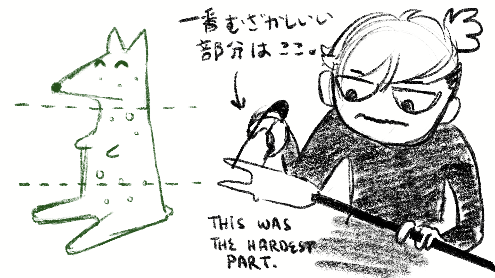
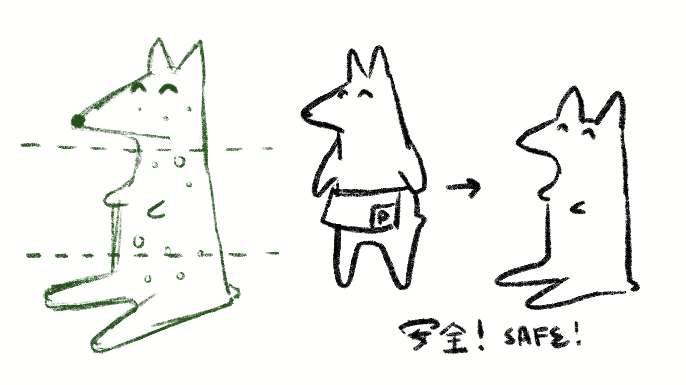
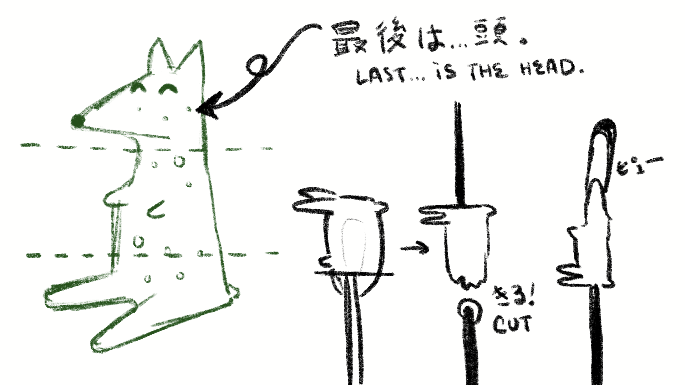
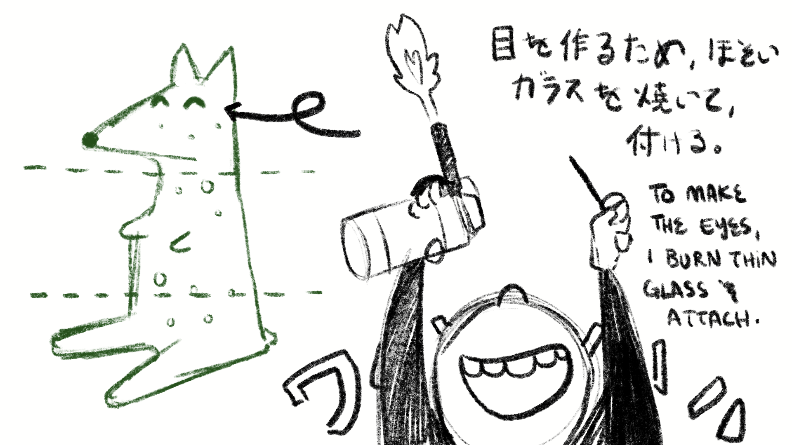
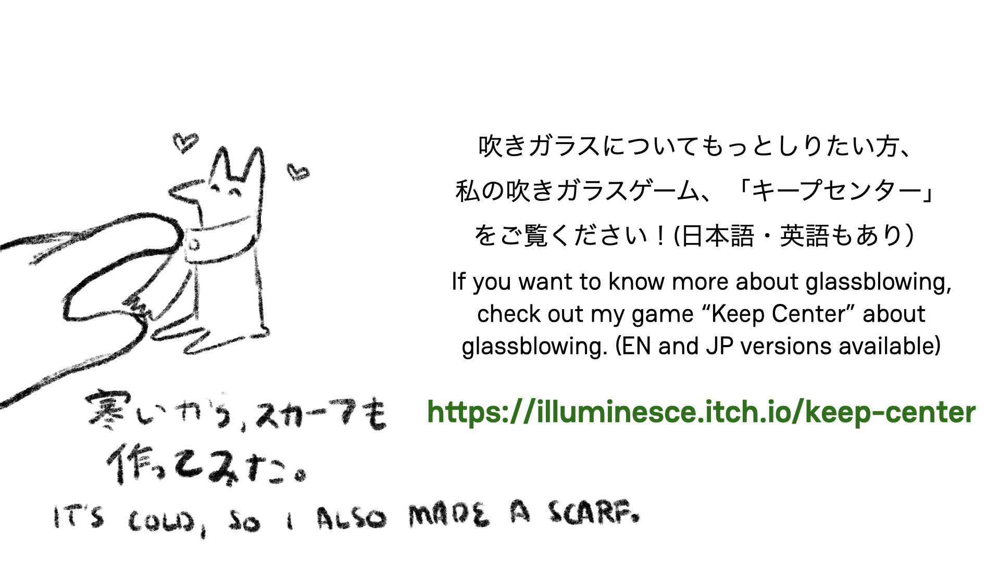

2025年の最後の[Picotachi 78](https://bsky.app/profile/picopicocafe.bsky.social)にて、5分のトーク程度のトークを行いました。Picotachi（月列）は、ゲームクリエイター・アーティスト・ミュージシャンが、創作途中の作品（Work‑In‑Progress）とプロセスについて気軽に共有する会です。

当初は [PICO‑8](https://www.lexaloffle.com/pico-8.php) のプロジェクトに関するトークでしたが、今は色々なドット絵、さらにはレトロゲームやアート作品も交えて紹介します。今年からピコピコカフェが再開したこともあり、できるだけPicotachiなどにも参加していきたいと思います。

以下のスライドは、Picotachi 78のトーク内容をまとめたものです。

[English version is here.](/blog/posts/2025-12-30-Picon-EN/)

東京のインディーズゲームシーンで、「ゲーム開発者」兼「GGJ（Global Game Jam）のオーガナイザー」として知られている私ですが、別の場面でトークしたいと思いました。2020年から趣味でガラス彫刻を制作しています。主に恐竜を作っていますが、今回は「Devlog」風にガラス彫刻について話したいと思います。

先月のPicotachiで、ピコピコカフェのオーナーらが、「ピコン」と呼ばれる可愛いマスコットの新デザインを紹介しました。（元々のピコンは、しっぽがありましたが、新デザインはしっぽがなくなり、変身した形です。）

「うわー、可愛いすぎる！」と感動しました。

深い理由はありませんが、「楽しさ」や「作者がきっと喜んでくれるだろう」と思い、挑戦してみました。

様々な形で試行錯誤しながら学んだ結果、ガラス彫刻を作る際は工程の順序が重要だと分かりました。そのため、ピコンの体を「頭・真ん中・足」の 3 部に分けたデザインにしました。

吹きガラスやガラス彫刻の経験者はあまり多くないので、イメージしにくいかもしれません。そこで、想像しやすくなるようイラストを追加しました。

まず、重曹で泡を作ります。「釜」と呼ばれる約 1000 度ほどの高温ガラスを棒で巻き、そこに重曹を付けて再び巻きます。重曹が付いた部分で泡が生じます。

それから、真ん中の形を整えます。

しかし、なぜ真ん中なのか？普通は頭が先だと思われますよね。

**実は！！**

逆に考えると、棒の先端が頭になり、足はガラスの先端になるので、真ん中は変わりません。真ん中は最も焼きにくい部分なので、ここから作業を始めるのは自然です。

「釜」全体で見ると、最も冷めやすいのは真ん中です。

**なるほど！**

直接ガラスに触れるのは危険です。鉄製のピンサーを使って、ガラスを引き出します。

足としっぽは、このように形作ります。

これが最も難しかった工程です。作品だけでは分かりませんが、何度も作り直し、かなり焦っていました。._.

理由は？

安定性が不足するとすぐに倒れてしまいます。倒れると壊れてしまうからです。ピコンはしっぽがあれば 3 点で立てられますが、しっぽがないので、どう立たせるか悩んでいました。

挑戦したいとは思いましたが、かなり難しいです！

結局「立つ」形は諦めて、「座る」形にしました。

最後は頭です！ 竿から「ポンテ」と呼ばれる部品に取り替えて、頭を作ります。

足としっぽと同じ、頭も少しずつ引っ張り出して形を整えました。頭を作ると同時に、体全体が少し伸びました。

目を作るために細長いガラス棒を加熱し、ペンのように直接ガラスに描くことができます。彫刻を作る前に、目の練習をしました。

（1 回巻いて、棒で多数の目を付けるイメージです。）

ガラスでガラスに描くのが個人的に好きなので、今回が一番楽しかったです（笑）。

単純な形でも、目を付けるだけでキャラクターらしくなります！

この季節は寒いので、ピコン用のスカーフも作りました。風をひかないで、ピコン！

ガラス彫刻の作り方、だいたい想像できましたか？

詳しく知りたい方には、吹きガラスの基礎を扱う[「キープセンター」（中心を取る）というビデオゲームを作っています。](https://illuminesce.itch.io/keep-center)日本語版・英語版がありますので、ぜひプレイしてみてください！

（日本語は母語ではないので、誤りがあればメールまたはコメントで教えてください。修正します！）

どうぞよろしくお願いいたします。

---

### 関連記事

- [My first glass art show at SARAU TOKYO (EN/JP)](/blog/posts/2024-03-16-Sarau-Tokyo-and-Glass-Art/)
- [PICOJAM 2025 アフターレポート](/blog/posts/2025-09-08-PICOJAM-2025-JP/)
- [GGJ 2025 アフターレポート](/blog/posts/2025-02-02-GGJ25JP/)

すべての[記事](/tags/japanese/)を見る。