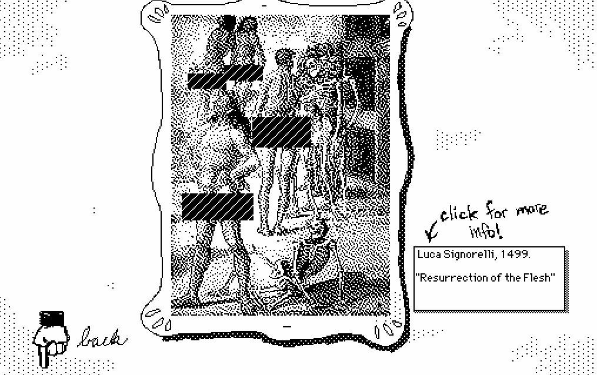

At the end of March, I released a game called [Family-Friendly Online Art Musuem (F.F.O.A.M.)](https://illuminesce.itch.io/ffoam) and in a week, it has surpassed 1,000 playthroughs.

Thank you to everyone who has played F.F.O.A.M. and especially to those who have rated and commented! I am honored.

To those of you who haven’t—it’s a short little browser game. [Go play it!](https://illuminesce.itch.io/ffoam)

Some of you may want to know...

**1. Why did you make this game?**

I go into [my reasons in more detail in the Studio Terranova newsletter](https://buttondown.com/studioterranova/archive/the-internet-in-the-age-of-verification/), but essentially—I think age verification is pointless, and does more to "look like" it's protecting children without doing much protecting. In addition to that, it serves as an underhanded way of censoring anything considered not "for kids" — and as some queer folks already know, much of our media, even if it is SFW, is considered "not safe for kids."

**2. Why is the F.F.A.R.T. so hard to pass?**

Maybe eat more fiber? 

All joking aside, it was based off the "age quiz" in [Leisure Suit Larry](https://allowe.com/games/larry/tips-manuals/lsl1-age-quiz.html) (CW: intense boomer humor). I wanted to make a quiz that was both frustrating, stupid and pointless, like I find age verification online to be. It delighted me, a sadistic way, that the quiz turned out to be much harder than I thought for players. 

A player even posted the answers to the quiz for those who didn't want to stumble through the answers. This is the equivalent of using [Sam Porter Bridge's face for age verification](https://www.pcgamer.com/hardware/brits-can-get-around-discords-age-verification-thanks-to-death-strandings-photo-mode-bypassing-the-measure-introduced-with-the-uks-online-safety-act-we-tried-it-and-it-works-thanks-kojima/), by the way. Very savvy.

**3. Are you planning to release any new rooms/artworks/updates for this game?**

Depends on if you want it! I liked making this game, so if you want to see more, let me know in the comments [on itch.io](https://illuminesce.itch.io/ffoam) or here — especially if you have artwork/artists that are in the public domain. (For legal reasons, I can't use artwork that isn't in the public domain.) For now, this game will only be in English.

I like the Staff Member, what a cutie.

Thank you so much to the players who have played, commented, and liked the game so far! You are so very appreciated.

Eat your fiber, and keep passing those F.F.A.R.T.S.

---

### Related Posts

- [Keep Center Postmortem](/blog/posts/2024-07-01-Keep-Center-Postmortem/)
- [Juicy learnings from a booty game](/blog/posts/2025-02-20-BubbleButt-Postmortem/)
- [Indie Games of Cohost: CJ from Studio Terranova](/blog/posts/2024-05-18-Indie-Games-of-Cohost)

See all posts tagged [Video Games](/tags/video-games/).
