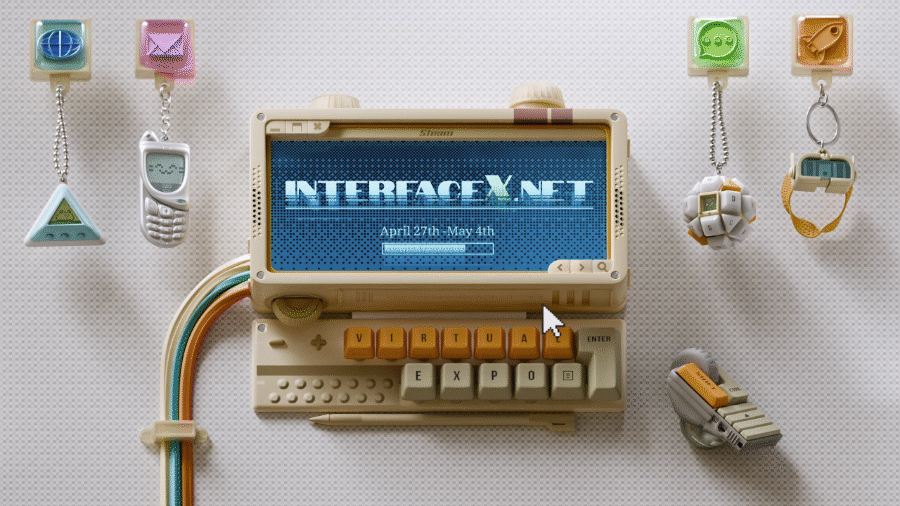
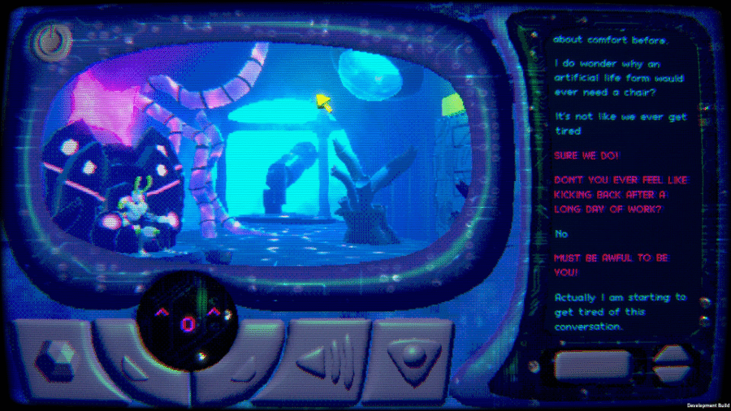

When mabbees and I were developing [Terranova](https://store.steampowered.com/app/1728700/Terranova/) in 2020, we noticed there were already a few games like ours such as Secret Little Haven, Her Story, and Emily is Away. They were typically tagged as "interactive fiction" but featured more than just words - they had interfaces where players could press buttons, drag sliders and play games in addition to playing through text-based stories.

Back then we named the genre, ["interface dramas"](https://illuminesce.dreamwidth.org/4214.html) as we saw the games simulating the "drama" of a stage play with the veneer of interface.

With the help of fellow gamedevs and fans, I started collecting these games: first, from the [interactive fiction database](https://ifdb.org/) and then itch.io and Steam into the [Interface Drama Master List](https://illuminesce.net/interface-drama). And now, six years later, I am so excited to see the very first sale event featuring ONLY interface dramas—Interface X26.

[https://store.steampowered.com/sale/InterfaceX26](**Check it out here.**)

The sale runs from April 27th-May 4th. 

This was organized by other game devs and organizers—I'm happy to be a part of it. They did a great job organizing this and collaboratively choosing the label "Fake OS." I admit, interface drama, while popular, didn't catch on as well! It is already being covered by [Kotaku](https://kotaku.com/steams-interface-x26-sale-celebrates-fake-oses-2000690983) and [80lv](https://80.lv/articles/150-developers-push-to-define-a-new-fake-os-genre-on-steam) other major news sites.

There will also be a streaming event on [Saturday, May 2nd at 10AM PDT on jessecox's Twitch.](https://www.twitch.tv/jessecox)

I'm so excited to see these games pick up steam.

Here's why you should play these games and why we DESPERATELY need a tag for this new genre.

## Why should I play Fake OS games?

Fake OS games are genre-expanding. They don't adhere to one specific type. There are deep puzzlers that excite the nerdiest mathematicians like [Zachtronic's EXA PUNKS](https://store.steampowered.com/app/716490/EXAPUNKS/), to investigative thrillers like [Desktop Explorer](https://store.steampowered.com/app/2527160/Desktop_Explorer/), [Immortality](https://store.steampowered.com/app/1350200/IMMORTALITY/), and [The Roottrees are Dead](https://store.steampowered.com/app/2754380/The_Roottrees_are_Dead/), to tear-jerking story games, like [Secret Little Haven](https://store.steampowered.com/app/827290/Secret_Little_Haven/)  (or [Terranova](https://store.steampowered.com/app/1728700/Terranova/)).

A significant portion of this genre also critiques technology and its various relationships to people. It tackles subjects on [surveillance](https://store.steampowered.com/app/491950/Orwell_Keeping_an_Eye_On_You/), [what it means to be "someone else" online](https://store.steampowered.com/app/712730/SIMULACRA/), or just [how uncomfortable it is to shoehorn certain human elements into a machine](https://pippinbarr.com/itisasifyouweremakinglove/). As someone who studies HCI (human-computer interaction), seeing broader discussions around this that aren't just in academic papers is so exciting.

In addition to familiar fake OSes, there are also ones that have a speculative fiction bent—games like [Panthalassa](https://store.steampowered.com/app/2955720/Panthalassa/) or [Human Errors](https://illuminesce.net/kmorayati/human-errors) that envision entirely new interfaces that could be.

They're usually short, easily played within a few sittings, and will leave you wanting more—which is great, because there's so many games to play in this genre if you know where to look. For those of us who grew up online, the nostalgia aspect of these games is like being trasnported back in time.

Really. There's no good "starting point" - just jump into a genre you like and get to exploring!

And by the way—for the academics in the house, yes—there are papers written and talks given on this genre.

- **Inbox Games: Poetics and Authoring Support** by Chris Martens and Robert J. Simmons in 2021 at the International Conference on Interactive Digital Storytelling (ICIDS) ([talk](https://www.youtube.com/watch?v=X5Hx4HCh_D4) | [paper](https://drive.google.com/file/d/1NZq02JIumJ06tiPXbGJM7gjx8JPava42/view))
- **Fantasy Filing Systems** by [Lee Tusman](https://leetusman.com/) in July 2022 at Narrascope ([slides](http://tinyurl.com/narrascope) | [list](https://leetusman.com/notes/txt/fantasy-filing-systems/))
- **Old Interfaces, New Stories** by [Katherine Morayati](https://katherinestasaph.itch.io/) & [Ian Michael Waddell](https://imw.itch.io/) in August 2022 through Interactive Fiction Technology Foundation ([video](https://www.youtube.com/watch?v=u5mMOsQDjJc) | [slides](https://docs.google.com/presentation/d/1VFXjpeXMUPjm3QcL5CiGXEhgOuZE8NLntcl9r6YDipo/edit?usp=sharing))
- **Interface Drama: A New Way of Telling Stories Through Software** by CJ and Matt ([transcript](https://illuminesce.net/talks/202212-interface-drama))

## Why should Fake OS games have their own tag?

I've been rallying on this for years—all of us who make Fake OS/interface drama games are **suffering!** Players who like this genre cannot easily sort for them, and we want to find them!

They're not easily discoverable. I some work in making the Master List accessible but—and I cannot stress this enough—the list was done on **my own hobby time**, as a singular person. Watching all of the press that the Interface X26 team has garnered and how hard the organizers have worked putting it together makes me even more convinced that we deserve more support to have properly searchable terms.

And look—I know mabbees and I coined "interface drama" so I'm biased — but Fake OS is a great name. It's easily understandable. And any tag that can allow our games to be more visible is a win in my book.

Alexander Zacherl dev from Cobalt Lane [made a handy tagging guide for folks to tag all the games in the Interface X26 event here.](https://interfacex.net/tag/)

Please use it to tag games, and if you want to tag any additional games from the [Interface Drama Master List](https://illuminesce.net/interface-drama), please do so. We need all the help we can get.

**And if someone from Steam is reading this...**

Please make us a tag. Make it searchable. These games will only get more and more popular from now on. 

I should know, I've been following this genre since 2020. It has only grown exponentially, year by year, and at this point, it's no longer a "hyper-indie" genre.

And to those of you who are gamedevs and fans of this genre—keep playing games! 

Write comments! Support devs. We truly wouldn't be where we were without your support. Thank you so much for all of the love you've given this genre so far. <3

---

### Related Posts

- [The Interface Drama Master List: What is it?](/blog/posts/2023-08-15-Interface-Drama-Master-List/)
- [Interface Dramas: Exploring Intrigue](/blog/posts/2024-04-18-Interface-Drama-Streaming-Vol1/)
- [The genre of interface dramas, fiction, visual novels and epistolary games](/blog/posts/2023-08-22-Interface-Drama/)

See all posts tagged [Interface Drama](/tags/interface-drama/).
