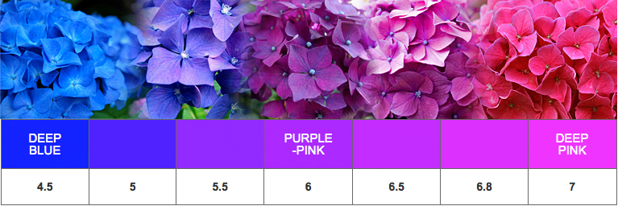
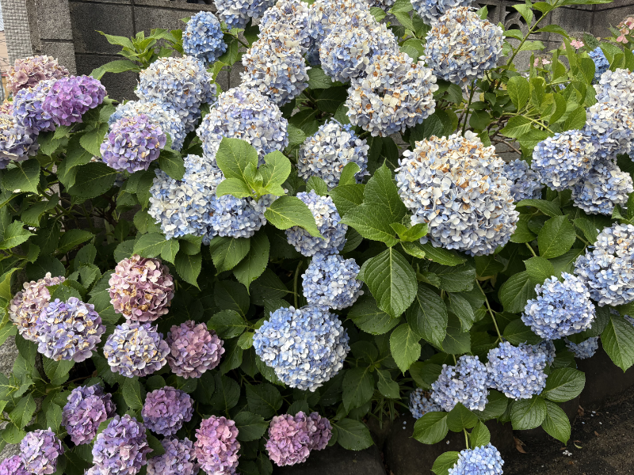
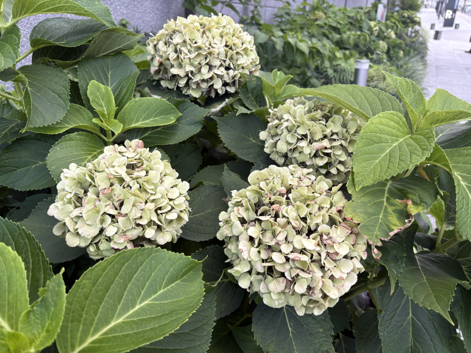
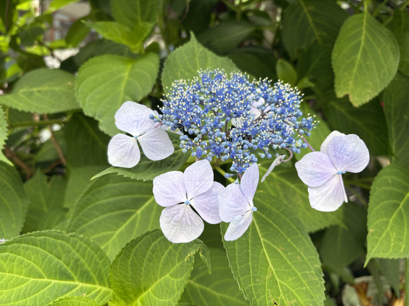
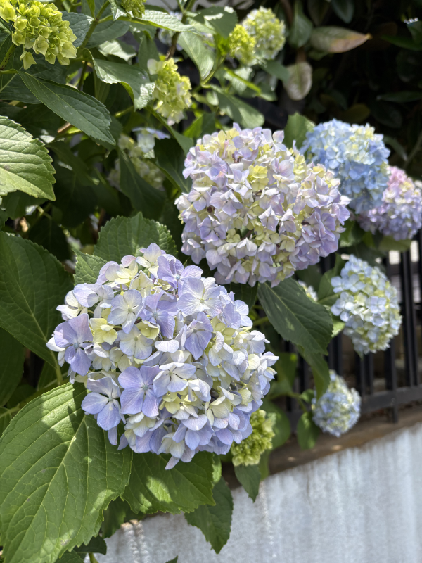
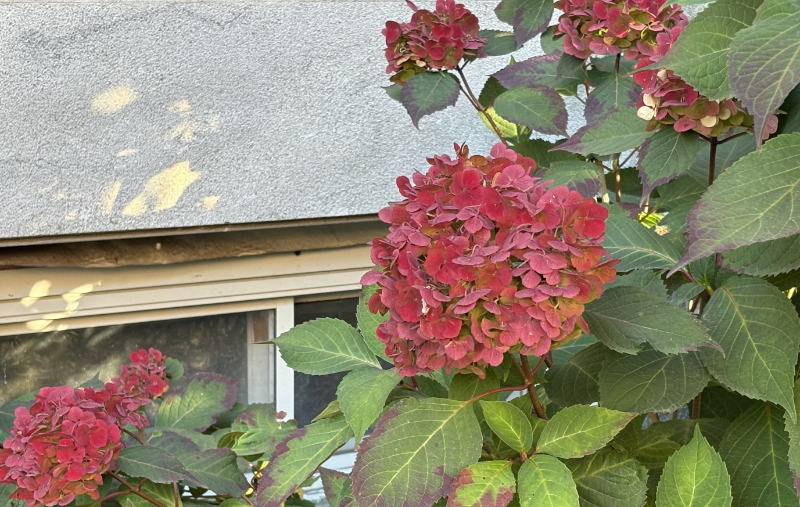
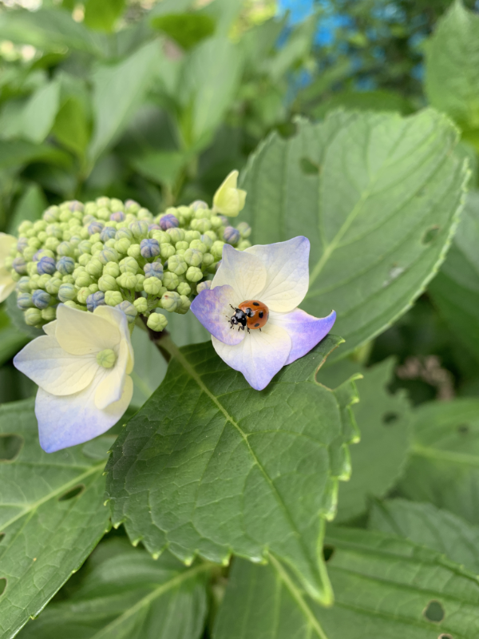

I have a lot of topics/subjects that have been percolating in my head: in April and May, the Steam Sales for Interface X26 made me realize how much other people are thinking about fake OS/interface drama games and their underlying themes. Studio Terranova is continuing and we're learning a lot about what makes a cooperative and how to run it sociocratically. A cooperative was, at its core, an organization for the trading and exchanging of physical goods, so in a digital age where everything is a subscription and things can't be shared, it's an especially tricky challenge to stay true to our shared roots. 

All interesting subjects, but right now on my walks in the neighborhood, I'm thinking about...flowers.

Specifically, ajisai, or hydrangeas.

[In 2023, I started an "ajisai report."](/blog/posts/2024-06-03-Ajisai-Report/) These were my posts of local ajisai blooms; it only blooms from late May to early July. When I was a child, I never knew they could be any other color but green, but this is not true - ajisai come in many different colors based on th pH of the soil they grow in. More alkaline is pink and more basic is blue.

*Thanks to [Lorraine Ballato](https://www.lorraineballato.com/changing-the-color-of-your-hydrangeas/) for the chart.*

I found that the area I used to live in tended to have more blue ajisai, and the area I live now has more pink. I was delighted to have, in real time, information about the soil.

Last year around this time, I was having a very rough time gender and identity-wise. I was mostly focused on work, which was enjoyable. Outside of that, I was pretty numb. This, unfortunately, coincided with a short *ajisai* season, where the blooms quickly burned up. I didn't *want* to skip last year, but my motivation was already low. When I saw how poor the *ajisai* were wilting, so did I.

They were still *there,* but were browning around the edges.

This year, we're back! In 2026, the *ajisai* are coming back stronger and more brilliant.

The buds have started to bloom, and a few years ago, a lavender ajisai has now turned lavender and green. I look forward to this season each year - when spring ends I feel down knowing that Tokyo summers are notoriously humid, but just for the *ajisai* I perk up.

I'm very grateful to have these wonderful blooms around me to enjoy.

I've compiled an album of all my past photos of *ajisai* in the hopes that anyone who'd like to do more art with them can find good reference photos, both for color and for shape.

([**View the ajisai report album here.**](https://photos.app.goo.gl/aXCEgnLpYNu3Fs6d8))

Til next time - I hope you all find something, even if small, to look forward to this week.

Here's some extra snaps of some ajisai - a red hydrangea I found on a lawn in the U.S. and one in Japan that has a very cute tenant.

---

### Related Posts

- [The Ajisai Report, 2023-2024](/blog/posts/2024-06-03-Ajisai-Report/)
- [A Solo Art Walk](/blog/posts/2025-12-26-A-Solo-Art-Walk/)

See all posts tagged [Personal](/tags/personal/).
